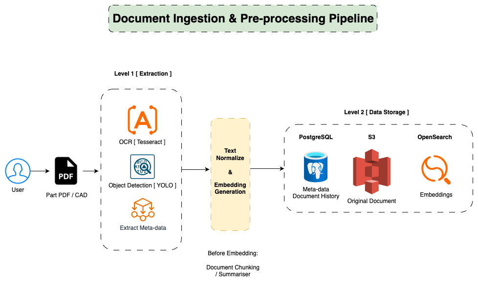
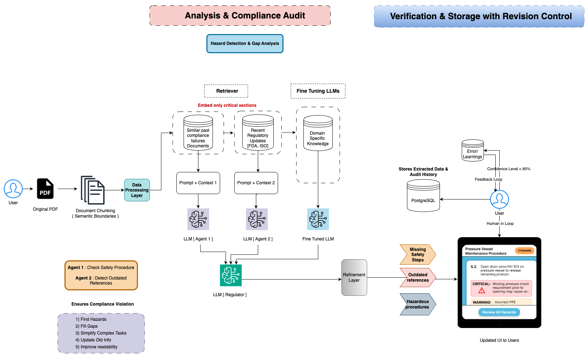

# 🔧 Interface: Scalable AI-Driven Compliance System Design

## 🧠 Overview
This repository presents a system design I created for **Interface**, a YC-backed AI startup focused on transforming regulatory compliance for industrial documentation. The objective was to design a scalable, cost-efficient, and intelligent platform leveraging **Retrieval-Augmented Generation (RAG)**, **LLMs**, and **human-in-the-loop validation** to automate compliance audits.

---

## 🚀 Interface Expectations & Goals
- Automate compliance validation for large regulatory documents & CAD files
- Handle 25-30 monthly users uploading 10-12 documents (600-800 pages each)
- Deliver fact-verified responses using LLMs
- Design a system with monthly cost between **$2K - $3K**
- Include error tracking, user feedback, and audit history
- Support document chunking, object detection, OCR, metadata extraction, and vector search

---

## 📊 System Architecture Overview

### 1. Cost & Infrastructure Planning

A breakdown of estimated monthly expenses across compute, storage, AI processing, and monitoring layers, with cost-saving alternatives for each.

---

### 2. Document Ingestion & Pre-processing

This layer includes:
- **OCR (Tesseract)** for extracting text from scanned documents
- **YOLO Object Detection** for CAD-specific insights
- **Metadata Extraction** for document tagging
- **Text Normalization & Embedding Generation**
- Data stored in **PostgreSQL, S3, and OpenSearch**

---

### 3. RAG-Based Compliance Audit

- Documents are chunked based on semantic boundaries
- Contextual prompts built from:
  - Past compliance failures
  - Recent regulatory updates (e.g., FDA, ISO)
  - Internal domain-specific knowledge
- Multiple LLM agents perform hazard detection, reference validation, and simplification
- A final **Regulator LLM** refines responses before surfacing results
- **Human-in-the-loop** validation is triggered if LLM confidence < 85%
- Updated UI reflects compliance issues: missing safety steps, outdated references, hazardous procedures

---

## 📍 Key Design Highlights
- Modular, microservice-friendly architecture
- Redis-based caching for reduced LLM load
- Embedded metadata version control
- PostgreSQL for audit logs, OpenSearch for vector retrieval
- Optimized for under $3K/month operational budget

---

## 💡 Future Enhancements
- Fine-tuning on expanded regulatory datasets (OSHA, NIST, ISO)
- Real-time ingestion from wearable/IoT compliance devices
- Streaming logs for continuous audit trail updates

---

## 🙌 Acknowledgment
Special thanks to the Interface team for sharing their vision. This system was designed as part of a technical interview round and reflects real-world design decisions around **cost**, **scalability**, and **AI readiness**.

---

## 🙏 Contributing
Open to collaboration and feedback! Feel free to raise an issue or fork the repo if you're interested in improving the design or contributing to similar projects.

